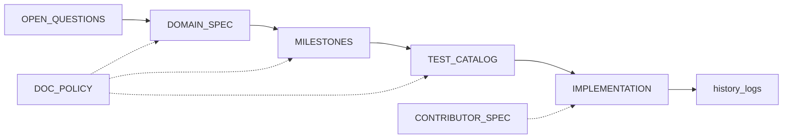

# Workflow map / 工作流地图

### English

**Purpose:** Ordered phases from intent to release. Details: linked templates and [`./global/SSOT-AND-MAINTENANCE-RULES.md`](./global/SSOT-AND-MAINTENANCE-RULES.md). **Last updated:** (set when forking).

| Phase | Inputs | Outputs | Gate |
|-------|--------|---------|------|
| 0 Charter | Problem, non-goals, compliance | Open questions filled | Named owners |
| 1 Domain | Journeys, invariants | `DOMAIN-OR-PRODUCT-SPEC.md` | No contra-spec work |
| 2 Architecture | Quality, deployment | ADRs, diagrams | Build/test documented |
| 3 Milestones | Slices, deps | `milestones/<date>/` | Acceptance mappable |
| 4 Tests | Acceptance, CI | `TEST-CATALOG.md` | No phantom tests |
| 5 Implementation | Specs, catalog | Code, history | SSOT respected |
| 6 Release | Changelog | Tags, history | Open questions triaged |

**Artifact graph / 制品图** (labels: EN concept names; 概念与 `global/ARTIFACT-LAYOUT.md` 一致):

### 简体中文

**文档作用：** 从意图到发布的**阶段顺序**；细则见各模板与本树 [`./global/SSOT-AND-MAINTENANCE-RULES.md`](./global/SSOT-AND-MAINTENANCE-RULES.md)。**Last updated：** （分叉时填写）。

阶段表与上门禁列一致：**阶段 0** 立项与开放问题；**阶段 1** 域权威规格；**阶段 2** 架构与 ADR；**阶段 3** 里程碑批次；**阶段 4** 测试目录对齐；**阶段 5** 实现与历史；**阶段 6** 发布与复盘。若缺人类判断，回到 `OPEN-QUESTIONS-AND-HUMAN-INPUT.md`。上图与英文共用同一 Mermaid 节点含义。
